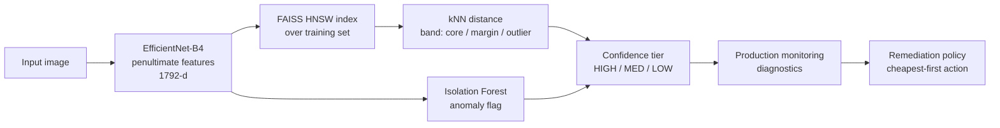

# pitwaller

**Embedding-space out-of-distribution detection, confidence tiering, and automated QA for CNN image classifiers.**

Production image classifiers don't fail loudly — they fail *silently* on inputs that drift away from what they were trained on, while still returning a confident-looking softmax. `pitwaller` catches that by scoring every prediction against the model's *own* feature space, sorting predictions into actionable confidence tiers, and — when quality degrades — recommending the cheapest corrective action that will actually fix the problem.

It runs end-to-end on synthetic data out of the box (no weights, no dataset required) so you can see the whole system work in seconds:

```bash
pip install -e .
python -m pitwaller.demo
```

```
Fitted OOD model on 2000 samples (p50=0.0280, p90=0.0335)

Tier distribution on production batch:
  HIGH  88  (44%)
  MED   37  (18%)
  LOW   75  (38%)

Diagnostics:
  n=200  OOD=35%  margin=20%  IF=34%
  accuracy overall = 79% (baseline 95%, drop 16.0%)
  accuracy by tier = HIGH:95%, MED:81%, LOW:59%

Remediation -- biggest job required: ENGINE_REBUILD

[ENGINE_REBUILD]
  - FULL_BACKBONE_RETRAIN  (days, gpu:heavy, labels, redeploy)
      Accuracy down 16.0% (severe, broad); retrain the full backbone on a refreshed dataset.
```

Notice the accuracy-by-tier line: **95% → 81% → 59%**. The confidence tier is monotonically related to accuracy, which is the empirical property the entire design depends on and exploits.

---

## How it works



### 1. OOD detection in the model's own feature space

Rather than bolting on a separate OOD detector, the system uses the classifier's penultimate-layer embeddings — the 1792-dim global-pooled features of EfficientNet-B4. The training set's embeddings *define* the in-distribution manifold. Two independent detectors run over them:

- **kNN distance** via a **FAISS HNSW** index. For any input, the mean distance to its *k* nearest training neighbours is a non-parametric local-density score. Calibrated against the training set's own distance distribution, it yields two cut-points: the **50th percentile** (edge of the dense core) and the **90th percentile** (beyond which a point is sparser than 90% of training data).
- **Isolation Forest**, a global structural anomaly detector that catches off-manifold points kNN distance alone can miss.

They're kept independent on purpose — they fail in different ways, and their *agreement* is the signal.

### 2. Confidence tiering

| kNN band | Isolation Forest | Tier |
|----------|------------------|------|
| core (≤ p50) | clean | **HIGH** |
| core / margin | exactly one detector concerned | **MED** |
| margin / outlier | both concerned | **LOW** |

Points beyond the 90th percentile are treated as **LOW** by default (`strict_outlier=True`); set it to `False` to reproduce a literal "one-signal-is-MED" rule. The mapping is pure and table-driven, so it's auditable and unit-tested exhaustively.

### 3. From tiering to automated QA

Monitoring aggregates production predictions into **diagnostics** (OOD rate, tier-distribution drift, accuracy overall and per-tier, per-class recall). A transparent, priority-ordered **policy engine** maps those diagnostics onto a remediation ladder, cheapest and least destructive first:

| Action | Triggered by |
|--------|--------------|
| `THRESHOLD_ADJUSTMENT` | tier distribution drifted, but per-tier accuracy intact |
| `BN_RECALIBRATION` | covariate shift: inputs drift, accuracy still holds |
| `PARTIAL_BACKBONE_RETRAIN` | moderate, broad accuracy drop |
| `ADASYN_REBALANCE` | one or more classes' recall collapsing |
| `FULL_BACKBONE_RETRAIN` | severe broad accuracy drop |
| `PRUNING` | latency/size pressure while accuracy is healthy |
| `ARCHITECTURE_REBUILD` | OOD rate stays high *after* retraining — the capacity ceiling |

The engine diagnoses the *kind* of failure, not just its magnitude, and **escalates** up the ladder when a cheap fix has been applied repeatedly without resolving the issue (so it doesn't loop forever recalibrating thresholds against a problem that needs a retrain).

### 4. Pit stop vs. engine rebuild

Every action carries an **effort tier** describing how time- and tech-intensive the fix actually is — the dimensions that matter operationally being wall-clock, whether you need labels, GPU intensity, and crucially *whether the model can keep serving while you do it*:

| Effort tier | Actions | What it costs | Model live? |
|-------------|---------|---------------|-------------|
| **PIT_STOP** | threshold adjust, BN recalibration | config/stats only, no training, seconds–minutes | ✅ stays live |
| **GARAGE** | pruning, partial retrain, ADASYN rebalance | bounded retrain on labelled data, hours | ⛔ redeploy |
| **ENGINE_REBUILD** | full backbone retrain | retrain the whole backbone, days, heavy GPU | ⛔ redeploy |
| **NEW_BUILD** | architecture rebuild | clean-sheet redesign, weeks, research effort | ⛔ redeploy |

(`GREEN_FLAG` is the fifth, no-action tier — everything within tolerance.)

`recommend()` returns recommendations cheapest-first; `group_by_effort()` buckets them by tier and `heaviest_tier()` tells you the biggest job this round of QA actually requires — so an operator instantly knows whether they're looking at a splash-and-go or a trip to the garage:

```python
from pitwaller import recommend, group_by_effort, heaviest_tier

recs = recommend(diag)
print("biggest job:", heaviest_tier(recs).value)        # e.g. ENGINE_REBUILD
for tier, group in group_by_effort(recs).items():
    print(tier.value, [r.action.value for r in group])
```

The bucketing never contradicts the cost ladder (there's a test for that): a heavier tier always implies a strictly costlier action.

### 5. Rigorous threshold selection (`calibration.py`)

The percentile cut-points (p50/p90) and an equal-cost operating point are fine defaults, but `calibration.py` provides statistically grounded alternatives for the thresholds employers will scrutinise most:

- **Conformal thresholds** — cut a nonconformity score (the kNN OOD distance) at the split-conformal quantile so the flag carries a finite-sample, distribution-free bound on the inlier rejection rate, replacing an eyeballed p90. The **weighted** variant (Tibshirani et al., 2019) preserves that bound under covariate shift using density-ratio weights — which the OOD model already estimates, so the machinery that *detects* shift also *corrects* the threshold for it.
- **Risk-coverage / AURC** — evaluate the whole confidence ordering as a selective predictor (Geifman & El-Yaniv) instead of scoring one operating point. `aurc`, `excess_aurc`, `selective_risk_at_coverage`, `coverage_at_risk`.
- **Cost- and constraint-based operating points** — `cost_optimal_threshold` (minimise expected cost under possibly-asymmetric error costs and a settable prevalence), `constraint_threshold` (maximise coverage subject to an FPR/precision constraint). `youden_j_threshold` is included as the equal-cost special case, for comparison.
- **Bootstrap CIs** that gate the auto-QA loop — `conformal_threshold_ci` yields a CI on the deployed cut; the policy then fires `THRESHOLD_ADJUSTMENT` only when the deployed threshold is *implausible* under recent data (a `ThresholdDriftSignal`), so it adjusts on real drift and ignores sampling noise.

```bash
python examples/calibration_analysis.py
```

```
1) Conformal outlier cut
   p90 (heuristic)        = 0.0332
   conformal q (alpha=0.05) = 0.0350
   guaranteed FPR <= 5%; realised on inliers = 4.0%
3) Operating points on the OOD score
   Youden's J            : thr=0.0375
   cost (miss 5x worse)  : thr=0.0343      # asymmetric cost flags more
   constraint FPR<=2%    : thr=0.0361 (fpr=2.0%, tpr=51%)
4) CI-gated threshold adjustment
   re-estimated cut = 0.0350  CI=[0.0343, 0.0359]
   deployed cut     = 0.0335  -> drift significant: True
```

### 6. BatchNorm recalibration, validated (`bn_recal.py`)

`BN_RECALIBRATION` is wrapped in the rigor it needs rather than fired blind: **justify** it by measuring per-layer input shift (closed-form 2-Wasserstein between the stored and fresh per-channel BN Gaussians, plus symmetric KL); **recalibrate** by re-estimating running stats over fresh *unlabelled* inputs (AdaBN — forward passes only, no gradients, no labels); then **validate** with McNemar's paired test on before/after correctness, promoting the change only if it's a real, significant net improvement rather than churn. The statistics are pure NumPy and tested; the two functions that touch a live model (`collect_bn_stats`, `recalibrate_bn`) are marked WIRE-IN and lazily import torch.

---

## Usage

```python
import numpy as np
from pitwaller import ConfidencePipeline, MockEmbedder, aggregate, recommend, PredictionRecord

# Swap MockEmbedder for EffNetB4Embedder in production (needs `pitwaller[torch]`).
pipe = ConfidencePipeline(MockEmbedder(dim=64), k=10, contamination=0.05)
pipe.fit(train_inputs)                      # fit OOD reference on training data

scored = pipe.score(production_inputs)      # -> [ScoredSample(ood=..., tier=...)]

records = [PredictionRecord(ood=s.ood, tier=s.tier, pred_label=p, true_label=y)
           for s, p, y in zip(scored, preds, labels)]
diag = aggregate(records, baseline_high_rate=0.85, baseline_accuracy=0.95)

for rec in recommend(diag):
    print(rec.severity.value, rec.action.value, "-", rec.rationale)
```

Using real EfficientNet-B4 features:

```python
from pitwaller.embeddings import EffNetB4Embedder
pipe = ConfidencePipeline(EffNetB4Embedder(device="cuda"))
```

Using CLIP features for semantic-novelty detection (needs `pitwaller[clip]`):

```python
import torch
from pitwaller.embeddings import CLIPEmbedder

emb = CLIPEmbedder(model_name="ViT-B-32", device="cuda")
batch = torch.stack([emb.preprocess(img) for img in pil_images])  # canonical CLIP transform
pipe = ConfidencePipeline(emb).fit(train_batches)
```

### Choosing the embedding

The OOD stack is substrate-agnostic — everything downstream of the `Embedder` works on whatever features you feed it — so the most consequential choice is *which* representation you measure novelty in:

- **The model's own task features** (`EffNetB4Embedder`) measure novelty *relative to what that model attends to*. Good when you're gating **this model's** competence — "is this input outside what my classifier was built to handle?" But these features are tuned to the training label set and collapse whatever was irrelevant to that task, so semantic content along those collapsed axes maps into existing clusters and goes undetected. A model can't reliably surface, through its own representation, the content it was never built to perceive.
- **Foundation / vision-language features** (`CLIPEmbedder`; DINOv2 is another strong option) carry broad semantic content rather than a narrow label set, so they're far stronger for detecting genuinely **novel content** (near-OOD / open-set / new categories). CLIP additionally lets you *characterize* what's novel by comparing against text-grounded concepts, not just flag that something is.

Rule of thumb: gating one model's competence → its own features are fine; cataloguing semantic content outside the training distribution (the open-set/novel-category goal) → use a foundation embedding. For near-OOD semantic novelty the representation matters more than the OOD score, so swapping the substrate moves the needle more than tuning kNN vs Isolation Forest.

---

## Project layout

```
src/pitwaller/
  embeddings.py   Embedder protocol; MockEmbedder + EffNetB4Embedder
  index.py        FAISS HNSW index (+ numpy brute-force fallback)
  ood.py          kNN-distance + Isolation Forest, percentile thresholds
  confidence.py   HIGH / MED / LOW tiering (pure, table-driven)
  calibration.py  conformal thresholds, risk-coverage/AURC, cost/constraint
                  operating points, bootstrap CIs
  bn_recal.py     BatchNorm recal: 2-Wasserstein shift test, AdaBN, McNemar
  monitoring.py   aggregate predictions -> diagnostics
  decisions.py    remediation escalation policy engine
  pipeline.py     end-to-end orchestration
  demo.py         runnable synthetic walkthrough
tests/            80 tests across every component
examples/         quickstart.py, calibration_analysis.py
```

## Design notes

- **Embedder is injected behind a `Protocol`.** The core never imports `torch`; the FAISS/OOD/tiering logic is tested entirely on synthetic features. PyTorch is an optional extra.
- **FAISS HNSW is the right index here**: the reference set is the whole training embedding set (potentially millions of vectors), queries are online, and approximate neighbours are sufficient to estimate density. A pure-numpy fallback keeps the package runnable anywhere.
- **The two OOD detectors are independent by design.** Folding their agreement into the tier is what makes MED a meaningful "needs a human / needs a second look" bucket rather than noise.
- **The policy engine is a transparent rule set, not a black box** — every recommendation carries the signals that triggered it, so an operator can audit *why*.

## Limitations & when to use this

No monitoring system is free, and this one makes specific bets. The main caveats:

- **OOD distance is a proxy for error, not error itself.** It flags inputs that are *novel*, not inputs that are *wrong*; confident in-distribution mistakes (overlapping classes, label noise, hard examples) pass through as HIGH.
- **It detects covariate shift, not concept drift.** If p(x) is stable but p(y|x) changes, the OOD signals stay quiet while accuracy falls — only the label-dependent accuracy monitor will notice.
- **It works in the model's own feature space**, which is optimised for class separation, not density. Genuinely novel inputs can collapse into dense regions and score as in-distribution, and in high dimensions the distance bands are thin and noise-sensitive.
- **The supervised half needs labels.** Accuracy-, recall-, and McNemar-based triggers depend on labelled production data, which is usually delayed and selection-biased; without labels you only have the unsupervised OOD signals.
- **The remediation policy is heuristic.** Its thresholds are tunable defaults, its symptom→fix mapping is correlational, and it has no built-in outcome feedback — treat its output as a ranked suggestion for a human, not an autopilot.
- **Conformal guarantees assume exchangeability**, which shift violates; the weighted variant helps only with good density-ratio estimates, and coverage is marginal, not per-class.

### Worth the effort when

- **Silent errors are expensive** — medical imaging, defect detection, perception, fraud — so routing low-confidence cases to a human or fallback pays for the overhead.
- **Your real risk is covariate shift** — new sensors/cameras, seasonal or geographic drift, an evolving input mix — which is the failure mode it actually detects well.
- **The model is long-lived and you'll maintain it**, so the per-checkpoint cost of rebuilding the index and recalibrating amortises.
- **The training distribution has clear structure** — clustered, well-sampled, with novel inputs genuinely off-manifold — so the kNN/IF geometry separates cleanly.
- **You can act on the tiers** — a review queue, a fallback model, a retraining loop — and at least some labels arrive eventually.

### Probably overkill when

- **Errors are cheap or easily corrected** (recommendations, soft tagging) — a max-softmax threshold or a simple accuracy dashboard is enough.
- **The input stream is stationary** (closed-world, controlled capture conditions) — drift detection is solving a non-problem.
- **Your dominant risk is concept or label drift** — invest in labelled drift tests on p(y|x) instead; this system is largely blind to it.
- **The model is short-lived** (prototypes, rapidly-replaced models) — the maintenance overhead never amortises.
- **Serving is latency- or memory-constrained** (edge) — a parametric score (Mahalanobis, energy) beats carrying the whole training-embedding index and running kNN per inference.
- **You have no labels and no capacity to act** — the auto-QA loop is then decorative.

**Rule of thumb:** reach for this when silent errors are costly, the model is long-lived, and covariate shift is a real and recurring risk — and start with a simpler confidence baseline (max-softmax or temperature scaling) first, graduating to this only once you've shown the simple thing is insufficient.

## Install

```bash
pip install -e .              # core: numpy, scikit-learn, faiss-cpu
pip install -e '.[torch]'     # + real EfficientNet-B4 features
pip install -e '.[dev]'       # + pytest, ruff
pytest                        # 80 tests
```

## License

MIT
