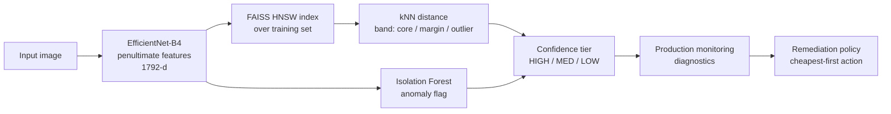

# pitwaller

[](https://github.com/norwytch/pitwaller/actions/workflows/ci.yml)
[](pyproject.toml)
[](LICENSE)
[](https://github.com/astral-sh/ruff)

**Embedding-space out-of-distribution detection, confidence tiering, and automated QA for image classifiers.**

Given an image classifier, its training dataset, and a production dataset, determine which data in the production dataset are OOD relative to the training dataset, and assign confidence scores based on OOD distance. Recommend remedial actions for the model based on model drift. Depends on certain assumptions about use case and distribution as detailed in [Limitations](#limitations--when-to-use-this). 

Our demo runs end-to-end on synthetic data out of the box. To test:

```bash
pip install -e .
python -m pitwaller.demo
```

```
Fitted OOD model on 2000 samples (p50=0.0280, p90=0.0335)

Tier distribution on production batch:
  HIGH  88  (44%)
  MED   37  (18%)
  LOW   75  (38%)

Diagnostics:
  n=200  OOD=35%  margin=20%  IF=34%
  accuracy overall = 79% (baseline 95%, drop 16.0%)
  accuracy by tier = HIGH:95%, MED:81%, LOW:59%

Remediation -- biggest job required: ENGINE_REBUILD

[ENGINE_REBUILD]
  - FULL_BACKBONE_RETRAIN  (days, gpu:heavy, labels, redeploy)
      Accuracy down 16.0% (severe, broad); retrain the full backbone on a refreshed dataset.

Label-calibrated tiers -- cuts placed at target error rates (ECE=0.03):
  p50/p90 marked 88 HIGH; risk-targeting re-tiers the same batch by tolerated error.
  accept HIGH      n= 13 (6%)  realised error 8%  (target <=5%)
  accept HIGH+MED  n=147 (74%)  realised error 14%  (target <=15%)
  route LOW        n= 53 (26%)  -- send to review / fallback
```

Note: the monotonic relationship between accuracy and OOD-distance based confidence tiering is a requirement for this framework. For more notes on this, see [Limitations](#limitations--when-to-use-this). 

The last block shows optional [label-calibrated tiering](#optional-label-calibrated-tiers-tier_calibrationpy): with labels, the cuts are set by tolerated error rate instead of distance percentile, so the 88 HIGH shrinks to the 13 that clear a 5% error bar.

---

## How it works



### 1. OOD detection in the model's own feature space

We work in the classifier's own feature space: the 1792-dim global-pooled features of EfficientNet-B4. The training embeddings define the in-distribution manifold, and two independent detectors run over them:

- **kNN distance** via a FAISS HNSW index. The mean distance to an input's k nearest training neighbours is a local-density score. Calibrated on the training set's own distances, it gives two cut-points: the 50th percentile (edge of the dense core) and the 90th (sparser than 90% of training data).
- **Isolation Forest**, a global structural anomaly detector that catches off-manifold points kNN distance alone can miss.

### 2. Confidence tiering

| kNN band | Isolation Forest | Tier |
|----------|------------------|------|
| core (≤ p50) | clean | **HIGH** |
| core / margin | exactly one detector concerned | **MED** |
| margin / outlier | both concerned | **LOW** |

Points past the 90th percentile default to LOW (`strict_outlier=True`); set it `False` for the literal "one-signal-is-MED" rule. The mapping is table-driven and exhaustively unit-tested.

This tiering needs no labels but is arbitrary: the cuts track the distance distribution, not the error rate you care about. With a labelled calibration set, [`tier_calibration.py`](#optional-label-calibrated-tiers-tier_calibrationpy) sets the tiers by error rate instead. It's opt-in via `pipeline.calibrate(...)`; p50/p90 stays the default until you call it.

### 3. From tiering to automated QA

Monitoring aggregates predictions into diagnostics (OOD rate, tier drift, accuracy overall and per-tier, per-class recall). A policy engine maps those onto a remediation ladder, cheapest fix first:

| Action | Triggered by |
|--------|--------------|
| `THRESHOLD_ADJUSTMENT` | tier distribution drifted, but per-tier accuracy intact |
| `BN_RECALIBRATION` | covariate shift: inputs drift, accuracy still holds |
| `PARTIAL_BACKBONE_RETRAIN` | moderate, broad accuracy drop |
| `ADASYN_REBALANCE` | one or more classes' recall collapsing |
| `FULL_BACKBONE_RETRAIN` | severe broad accuracy drop |
| `PRUNING` | latency/size pressure while accuracy is healthy |
| `ARCHITECTURE_REBUILD` | OOD rate stays high after retraining (the capacity ceiling) |

The engine diagnoses the kind and size of failure, and escalates when a cheap fix has been tried repeatedly without resolving it.

### 4. Pit stop vs. engine rebuild

Each action carries an effort tier: how time-, labor-, and compute-intensive the fix is, and whether the model stays live during it.

| Effort tier | Actions | What it costs | Model live? |
|-------------|---------|---------------|-------------|
| **PIT_STOP** | threshold adjust, BN recalibration | config/stats only, no training, seconds–minutes | ✅ stays live |
| **GARAGE** | pruning, partial retrain, ADASYN rebalance | bounded retrain on labelled data, hours | ⛔ redeploy |
| **ENGINE_REBUILD** | full backbone retrain | retrain the whole backbone, days, heavy GPU | ⛔ redeploy |
| **NEW_BUILD** | architecture rebuild | clean-sheet redesign, weeks, research effort | ⛔ redeploy |

(`GREEN_FLAG` is the fifth, no-action tier: everything within tolerance.)

`recommend()` returns actions cheapest-first; `group_by_effort()` buckets them by tier, and `heaviest_tier()` reports the biggest job this round requires:

```python
from pitwaller import recommend, group_by_effort, heaviest_tier

recs = recommend(diag)
print("biggest job:", heaviest_tier(recs).value)        # e.g. ENGINE_REBUILD
for tier, group in group_by_effort(recs).items():
    print(tier.value, [r.action.value for r in group])
```

The bucketing never contradicts the cost ladder (there's a test for that): a heavier tier always implies a strictly costlier action.

### Optional: label-calibrated tiers (`tier_calibration.py`)

The p50/p90 cuts answer "how far from training data?", not "how much can I trust this?". Given a labelled calibration set, `tier_calibration.py` sets the tiers by what they promise, in two steps:

1. **Fuse the signals into one reliability score.** A logistic map `[kNN distance, IF score, …] → P(correct)` replaces both the percentile cuts and the AND/OR table with a single ordered score. It uses the continuous Isolation-Forest score (`OODResult.if_score`), not the thresholded flag, so no information is discarded. A reliability diagram and ECE check the fit; the coefficients show how each signal moves reliability.
2. **Place the cuts at risk targets.** Each cut bounds the selective risk of a cumulative accept set: accept everything tiered HIGH and the error rate stays under `risk_high` (default 1%); accept HIGH+MED and it stays under `risk_med` (default 5%). This is what an operator routes on ("if I auto-accept HIGH, what's my error?"). Pass `delta` for a finite-sample guarantee (a Hoeffding bound tested down a nested threshold sequence, RCPS-style), so HIGH means certified ≤ `risk_high` error. With `delta=None` the empirical cut holds in-sample, with the usual out-of-sample slack.

It's opt-in: the pipeline uses p50/p90 until you call `calibrate`:

```python
pipe = ConfidencePipeline(embedder).fit(train_inputs)        # p50/p90 tiering
pipe.calibrate(cal_inputs, cal_correct, risk_high=0.01, risk_med=0.05)  # -> risk-targeted
scored = pipe.score(prod_inputs)                             # HIGH now means "<=1% error"
```

`python -m pitwaller.demo` shows this: p50/p90 calls 88 samples HIGH, risk-targeting keeps the 13 that clear a 5% bar, and HIGH+MED (74% coverage) realises 14% error against a 15% target.

---

## Usage

Construct a pipeline with an embedder, `fit` the OOD reference, and `score` production inputs into `(OODResult, tier)` pairs. The monitoring and remediation half is in [Example](#example-wrapping-a-classifier) below.

```python
from pitwaller import ConfidencePipeline, MockEmbedder

# Swap MockEmbedder for EffNetB4Embedder in production (needs `pitwaller[torch]`).
pipe = ConfidencePipeline(MockEmbedder(dim=64), k=10, contamination=0.05)
pipe.fit(train_inputs)                       # fit the OOD reference on training data
scored = pipe.score(production_inputs)       # -> [ScoredSample(ood=..., tier=...)]

# Optional: with a labelled set, recalibrate the tiers to target error rates.
pipe.calibrate(cal_inputs, cal_correct, risk_high=0.01, risk_med=0.05)
```

Using real EfficientNet-B4 features:

```python
from pitwaller.embeddings import EffNetB4Embedder
pipe = ConfidencePipeline(EffNetB4Embedder(device="cuda"))
```

Using CLIP features for semantic-novelty detection (needs `pitwaller[clip]`):

```python
import torch
from pitwaller.embeddings import CLIPEmbedder

emb = CLIPEmbedder(model_name="ViT-B-32", device="cuda")
batch = torch.stack([emb.preprocess(img) for img in pil_images])  # canonical CLIP transform
pipe = ConfidencePipeline(emb).fit(train_batches)
```

### Choosing the embedding

The OOD stack is substrate-agnostic: everything downstream of `Embedder` works on whatever features you feed it. The main choice is which representation you measure novelty in:

- **The model's own task features** (`EffNetB4Embedder`) measure novelty relative to what the model attends to. Good for gating this model's competence ("is this input outside what my classifier handles?"). But they're tuned to the training labels and collapse whatever was irrelevant to the task, so novelty along those collapsed axes maps into existing clusters and goes undetected.
- **Foundation / vision-language features** (`CLIPEmbedder`, or DINOv2) carry broad semantic content, so they're stronger for detecting genuinely novel content (near-OOD / open-set / new categories). CLIP also lets you characterise what's novel against text concepts, not just flag that it is.

Rule of thumb: gating one model's competence → its own features; cataloguing novel content (open-set / new categories) → a foundation embedding. For near-OOD novelty the representation matters more than the OOD score, so the substrate choice beats tuning kNN vs Isolation Forest.

---

## Example: wrapping a classifier

Say you have a trained image classifier and want to gate its predictions by confidence. Fit the OOD reference once on the training set, then score production inputs and route by tier.

```python
from pitwaller import ConfidencePipeline, Tier
from pitwaller.embeddings import EffNetB4Embedder

# Fit the OOD reference on the same data the classifier was trained on.
# (EffNetB4Embedder needs `pitwaller[torch]`; swap in any Embedder you like.)
pipe = ConfidencePipeline(EffNetB4Embedder(device="cuda"), k=10, contamination=0.05)
pipe.fit(train_images)

# Score production inputs; trust HIGH, send the rest for review / a fallback.
for inp, scored in zip(prod_inputs, pipe.score(prod_inputs)):
    pred = classifier(inp)
    if scored.tier is Tier.HIGH:
        accept(pred)
    else:
        route_to_review(inp, pred)   # MED / LOW
```

When labels arrive (often late), aggregate a window of predictions into diagnostics and ask the policy what to do:

```python
from pitwaller import PredictionRecord, aggregate, recommend

records = [PredictionRecord(ood=s.ood, tier=s.tier, pred_label=p, true_label=y)
           for s, p, y in zip(scored_window, preds, labels)]
diag = aggregate(records, baseline_high_rate=0.85, baseline_accuracy=0.95)

for rec in recommend(diag):
    print(rec.severity.value, rec.action.value, "-", rec.rationale)
```

If the policy recommends `BN_RECALIBRATION` (covariate shift: inputs drifted, accuracy held), `bn_recal.py` gives the justify → recalibrate → validate path so you don't fire it blind:

```python
from pitwaller.bn_recal import (
    collect_bn_stats, feature_stats, bn_shift_report, should_recalibrate,
    recalibrate_bn, validate_recalibration,
)

# 1. Justify: did the BatchNorm input stats actually move?
report = bn_shift_report(
    collect_bn_stats(model),
    {name: feature_stats(acts) for name, acts in recent_activations.items()},
)
if should_recalibrate(report, w2_threshold):
    # 2. Recalibrate on fresh, unlabelled inputs (forward passes only).
    recalibrate_bn(model, fresh_unlabelled_batches)
    # 3. Validate: promote only on a significant net improvement (McNemar).
    if validate_recalibration(correct_before, correct_after).significant_improvement():
        promote(model)
```

For a runnable version on synthetic data (no weights or dataset required), see [`examples/quickstart.py`](examples/quickstart.py) and `python -m pitwaller.demo`.

---

## Project layout

```
src/pitwaller/
  embeddings.py   Embedder protocol; MockEmbedder + EffNetB4Embedder
  index.py        FAISS HNSW index (+ numpy brute-force fallback)
  ood.py          kNN-distance + Isolation Forest, percentile thresholds
  confidence.py   default HIGH / MED / LOW tiering from the OOD signals (label-free)
  tier_calibration.py  opt-in tier upgrade: reliability map + risk-targeted cuts (needs labels)
  calibration.py  standalone single-threshold toolkit (independent of the above):
                  conformal bounds, risk-coverage/AURC, cost/constraint, bootstrap CIs
  bn_recal.py     BatchNorm recal: 2-Wasserstein shift test, AdaBN, McNemar
  monitoring.py   aggregate predictions -> diagnostics
  decisions.py    remediation escalation policy engine
  pipeline.py     end-to-end orchestration
  demo.py         runnable synthetic walkthrough
tests/            92 tests across every component
examples/         quickstart.py, calibration_analysis.py
```

## Limitations & when to use this

This system was built for a specific use case and makes specific bets. The main assumptions and caveats:

- **The tiers assume a monotonic distance–accuracy relationship.** The design rests on accuracy rising as inputs approach the dense core (HIGH > MED > LOW). This held in the original system and the demo (95% → 81% → 59%), but verify it on your data: where distance and accuracy decouple, the tiers carry no signal. The optional [label-calibrated tiers](#optional-label-calibrated-tiers-tier_calibrationpy) measure the relationship instead of assuming it.
- **OOD distance is a proxy for error, not error itself.** It flags inputs that are *novel*, not inputs that are *wrong*; confident in-distribution mistakes (overlapping classes, label noise, hard examples) pass through as HIGH.
- **It detects covariate shift, not concept drift.** If p(x) is stable but p(y|x) changes, the OOD signals stay quiet while accuracy falls; only the label-dependent accuracy monitor notices.
- **It works in the model's own feature space**, which is optimised for class separation, not density. Novel inputs can collapse into dense regions and score as in-distribution, and in high dimensions the distance bands are thin and noise-sensitive.
- **The supervised half needs labels.** Accuracy-, recall-, and McNemar-based triggers depend on labelled production data, which is usually delayed and selection-biased; without labels you only have the unsupervised OOD signals.
- **The remediation policy is heuristic.** Its thresholds are tunable defaults, its symptom→fix mapping is correlational, and it has no outcome feedback. Treat its output as a ranked suggestion for a human, not an autopilot.
- **Conformal guarantees assume exchangeability**, which shift violates; the weighted variant helps only with good density-ratio estimates, and coverage is marginal, not per-class.

### Worth the effort when

- **Silent errors are expensive** (medical imaging, defect detection, perception, fraud), so routing low-confidence cases to a human or fallback pays off.
- **Your real risk is covariate shift** (new sensors/cameras, seasonal or geographic drift, an evolving input mix), the failure mode it detects well.
- **The model is long-lived and you'll maintain it**, so the per-checkpoint cost of rebuilding the index and recalibrating amortises.
- **The training distribution has clear structure** (clustered, well-sampled, novel inputs off-manifold), so the kNN/IF geometry separates cleanly.
- **You can act on the tiers** (a review queue, a fallback model, a retraining loop), and at least some labels arrive eventually.

### Probably overkill when

- **Errors are cheap or easily corrected** (recommendations, soft tagging): a max-softmax threshold or simple accuracy dashboard is enough.
- **The input stream is stationary** (closed-world, controlled capture): drift detection is solving a non-problem.
- **Your dominant risk is concept or label drift**: invest in labelled drift tests on p(y|x) instead; this system is largely blind to it.
- **The model is short-lived** (prototypes, rapidly-replaced models): the maintenance overhead never amortises.
- **Serving is latency- or memory-constrained** (edge): a parametric score (Mahalanobis, energy) beats carrying the whole training-embedding index and running kNN per inference.
- **You have no labels and no capacity to act**: the auto-QA loop is then decorative.

## Install

```bash
pip install -e .              # core: numpy, scikit-learn, faiss-cpu
pip install -e '.[torch]'     # + real EfficientNet-B4 features
pip install -e '.[dev]'       # + pytest, ruff
pytest                        # 92 tests
```

## License

MIT
