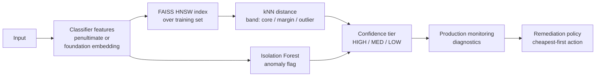

# pitwaller

[](https://github.com/norwytch/pitwaller/actions/workflows/ci.yml)
[](pyproject.toml)
[](LICENSE)
[](https://github.com/astral-sh/ruff)

**Embedding-space out-of-distribution detection, confidence tiering, and automated QA for classifiers.**

Given a trained classifier and its training set, `pitwaller` scores each production input against the model's own feature space, sorts it into a confidence tier (HIGH / MED / LOW), and recommends the cheapest corrective action when quality degrades. The OOD and tiering core is substrate-agnostic: it works on any classifier's embeddings, whether image, text, or tabular. It depends on assumptions detailed in [Limitations](#limitations--when-to-use-this).

## Results

**Covariate shift: the case it is built for.** A sentiment classifier trained on movie reviews (Rotten Tomatoes), then fed product reviews (Amazon) as a shifted input domain with the same pos/neg labels. The embedding-space OOD score flags the shift that max-softmax is blind to:

```
Detecting the shifted domain (AUROC, product vs movie):
  pitwaller kNN-distance : 0.817
  max-softmax baseline   : 0.508    (chance)
```

Max-softmax confidence barely moves across domains (70.8% in-domain → 70.5% shifted), so it cannot tell anything changed; the kNN-distance score catches it. Accuracy itself only dips 74% → 72% here; the point is that the OOD signal fires on the input shift, not that accuracy has to collapse first.

**Near-OOD: confidence tiers track accuracy.** On 20 Newsgroups with held-out categories, accuracy falls monotonically down the tiers, measured on real data rather than assigned:

```
Accuracy by confidence tier:  HIGH 94%  >  MED 92%  >  LOW 75%
```

Reproduce both (downloads a small sentence-transformer + datasets; a few minutes on CPU):

```bash
pip install -e '.[text]'
python examples/benchmark_covariate_shift.py   # 0.82 vs 0.51 AUROC under shift
python examples/benchmark_text_ood.py          # tier-accuracy curve on near-OOD
```

Or run the whole pipeline on synthetic data with no downloads, as a smoke test: `pip install -e . && python -m pitwaller.demo`.

The tiers are only meaningful where accuracy rises toward the dense core, a property to verify on your data rather than assume (see [Limitations](#limitations--when-to-use-this)).

---

## How it works



### 1. OOD detection in the model's own feature space

We work in the classifier's own feature space, its penultimate-layer embeddings (e.g. EfficientNet-B4's 1792-dim pooled features for images, an MLP's last hidden layer for tabular, or a sentence-transformer's vectors for text). The training embeddings define the in-distribution manifold, and two independent detectors run over them:

- **kNN distance** via a FAISS HNSW index. The mean distance to an input's k nearest training neighbours is a local-density score. Calibrated on the training set's own distances, it gives two cut-points: the 50th percentile (edge of the dense core) and the 90th (sparser than 90% of training data).
- **Isolation Forest**, a global structural anomaly detector that catches off-manifold points kNN distance alone can miss.

### 2. Confidence tiering

| kNN band | Isolation Forest | Tier |
|----------|------------------|------|
| core (≤ p50) | clean | **HIGH** |
| core / margin | exactly one detector concerned | **MED** |
| margin / outlier | both concerned | **LOW** |

Points past the 90th percentile default to LOW (`strict_outlier=True`); set it `False` for the literal "one-signal-is-MED" rule. The mapping is table-driven and exhaustively unit-tested.

This tiering needs no labels but is arbitrary: the cuts track the distance distribution, not the error rate you care about. With a labelled calibration set, [`tier_calibration.py`](#optional-label-calibrated-tiers-tier_calibrationpy) sets the tiers by error rate instead. It's opt-in via `pipeline.calibrate(...)`; p50/p90 stays the default until you call it.

### 3. From tiering to automated QA

Monitoring aggregates predictions into diagnostics (OOD rate, tier drift, accuracy overall and per-tier, per-class recall). A policy engine maps those onto a remediation ladder, cheapest fix first:

| Action | Triggered by |
|--------|--------------|
| `THRESHOLD_ADJUSTMENT` | tier distribution drifted, but per-tier accuracy intact |
| `BN_RECALIBRATION` | covariate shift: inputs drift, accuracy still holds |
| `PARTIAL_BACKBONE_RETRAIN` | moderate, broad accuracy drop |
| `ADASYN_REBALANCE` | one or more classes' recall collapsing |
| `FULL_BACKBONE_RETRAIN` | severe broad accuracy drop |
| `PRUNING` | latency/size pressure while accuracy is healthy |
| `ARCHITECTURE_REBUILD` | OOD rate stays high after retraining (the capacity ceiling) |

The engine diagnoses the kind and size of failure, and escalates when a cheap fix has been tried repeatedly without resolving it. The action set reflects a deep-network deployment (BatchNorm recal, backbone retrain), so this half is CNN-oriented; the OOD detection and tiering above are classifier-agnostic.

### 4. Pit stop vs. engine rebuild

Each action carries an effort tier: how time-, labor-, and compute-intensive the fix is, and whether the model stays live during it.

| Effort tier | Actions | What it costs | Model live? |
|-------------|---------|---------------|-------------|
| **PIT_STOP** | threshold adjust, BN recalibration | config/stats only, no training, seconds–minutes | ✅ stays live |
| **GARAGE** | pruning, partial retrain, ADASYN rebalance | bounded retrain on labelled data, hours | ⛔ redeploy |
| **ENGINE_REBUILD** | full backbone retrain | retrain the whole backbone, days, heavy GPU | ⛔ redeploy |
| **NEW_BUILD** | architecture rebuild | clean-sheet redesign, weeks, research effort | ⛔ redeploy |

(`GREEN_FLAG` is the fifth, no-action tier: everything within tolerance.)

`recommend()` returns actions cheapest-first; `group_by_effort()` buckets them by tier, and `heaviest_tier()` reports the biggest job this round requires:

```python
from pitwaller.experimental import recommend, group_by_effort, heaviest_tier

recs = recommend(diag)
print("biggest job:", heaviest_tier(recs).value)        # e.g. ENGINE_REBUILD
for tier, group in group_by_effort(recs).items():
    print(tier.value, [r.action.value for r in group])
```

The bucketing never contradicts the cost ladder (there's a test for that): a heavier tier always implies a strictly costlier action.

### Optional: label-calibrated tiers (`tier_calibration.py`)

The p50/p90 cuts answer "how far from training data?", not "how much can I trust this?". Given a labelled calibration set, `tier_calibration.py` sets the tiers by what they promise, in two steps:

1. **Fuse the signals into one reliability score.** A logistic map `[kNN distance, IF score, …] → P(correct)` replaces both the percentile cuts and the AND/OR table with a single ordered score. It uses the continuous Isolation-Forest score (`OODResult.if_score`), not the thresholded flag, so no information is discarded. A reliability diagram and ECE check the fit; the coefficients show how each signal moves reliability.
2. **Place the cuts at risk targets.** Each cut bounds the selective risk of a cumulative accept set: accept everything tiered HIGH and the error rate stays under `risk_high` (default 1%); accept HIGH+MED and it stays under `risk_med` (default 5%). This is what an operator routes on ("if I auto-accept HIGH, what's my error?"). Pass `delta` for a finite-sample guarantee (a Hoeffding bound tested down a nested threshold sequence, RCPS-style), so HIGH means certified ≤ `risk_high` error. With `delta=None` the empirical cut holds in-sample, with the usual out-of-sample slack.

It's opt-in: the pipeline uses p50/p90 until you call `calibrate`:

```python
pipe = ConfidencePipeline(embedder).fit(train_inputs)        # p50/p90 tiering
pipe.calibrate(cal_inputs, cal_correct, risk_high=0.01, risk_med=0.05)  # -> risk-targeted
scored = pipe.score(prod_inputs)                             # HIGH now means "<=1% error"
```

`python -m pitwaller.demo` illustrates the mechanic on synthetic data: p50/p90 calls 88 samples HIGH, risk-targeting keeps the 13 that clear a 5% bar, and HIGH+MED (74% coverage) realises 14% error against a 15% target.

---

## Usage

Construct a pipeline with an embedder, `fit` the OOD reference, and `score` production inputs into `(OODResult, tier)` pairs. The monitoring and remediation half is in [Example](#example-wrapping-a-classifier) below.

```python
from pitwaller import ConfidencePipeline, MockEmbedder

# Swap MockEmbedder for a real Embedder in production (see "Choosing the embedding").
pipe = ConfidencePipeline(MockEmbedder(dim=64), k=10, contamination=0.05)
pipe.fit(train_inputs)                       # fit the OOD reference on training data
scored = pipe.score(production_inputs)       # -> [ScoredSample(ood=..., tier=...)]

# Optional: with a labelled set, recalibrate the tiers to target error rates.
pipe.calibrate(cal_inputs, cal_correct, risk_high=0.01, risk_med=0.05)
```

Real embedders are injected the same way (each lazily imports its own extra):

```python
from pitwaller.embeddings import EffNetB4Embedder, SentenceTransformerEmbedder

img_pipe = ConfidencePipeline(EffNetB4Embedder(device="cuda"))          # pitwaller[torch]
txt_pipe = ConfidencePipeline(SentenceTransformerEmbedder()).fit(docs)  # pitwaller[text]
```

### Choosing the embedding

The OOD stack is substrate-agnostic: everything downstream of `Embedder` works on whatever features you feed it. The main choice is which representation you measure novelty in:

- **The model's own task features** (`EffNetB4Embedder` for images, an MLP's last hidden layer for tabular) measure novelty relative to what the model attends to. Good for gating this model's competence ("is this input outside what my classifier handles?"). But they're tuned to the training labels and collapse whatever was irrelevant to the task, so novelty along those collapsed axes maps into existing clusters and goes undetected.
- **Foundation features** (`CLIPEmbedder` or DINOv2 for images, `SentenceTransformerEmbedder` for text) carry broad semantic content, so they're stronger for detecting novel content (near-OOD / open-set / new categories). They also characterise what is novel, not just flag that something is.

Rule of thumb: gating one model's competence → its own features; cataloguing novel content (open-set / new categories) → a foundation embedding. For near-OOD novelty the representation matters more than the OOD score, so the substrate choice beats tuning kNN vs Isolation Forest.

---

## Example: wrapping a classifier

Say you have a trained classifier and want to gate its predictions by confidence. Fit the OOD reference once on the training set, then score production inputs and route by tier.

```python
from pitwaller import ConfidencePipeline, Tier
from pitwaller.embeddings import SentenceTransformerEmbedder

# Fit the OOD reference on the same data the classifier was trained on.
# (Swap in any Embedder: EffNetB4Embedder for images, an MLP's features for tabular.)
pipe = ConfidencePipeline(SentenceTransformerEmbedder(), k=10, contamination=0.05)
pipe.fit(train_docs)

# Score production inputs; trust HIGH, send the rest for review / a fallback.
for inp, scored in zip(prod_inputs, pipe.score(prod_inputs)):
    pred = classifier(inp)
    if scored.tier is Tier.HIGH:
        accept(pred)
    else:
        route_to_review(inp, pred)   # MED / LOW
```

When labels arrive (often late), aggregate a window of predictions into diagnostics and ask the policy what to do:

```python
from pitwaller import PredictionRecord, aggregate
from pitwaller.experimental import recommend

records = [PredictionRecord(ood=s.ood, tier=s.tier, pred_label=p, true_label=y)
           for s, p, y in zip(scored_window, preds, labels)]
diag = aggregate(records, baseline_high_rate=0.85, baseline_accuracy=0.95)

for rec in recommend(diag):
    print(rec.severity.value, rec.action.value, "-", rec.rationale)
```

If your model has BatchNorm and the policy recommends `BN_RECALIBRATION` (covariate shift: inputs drifted, accuracy held), `bn_recal.py` gives the justify → recalibrate → validate path so you don't fire it blind:

```python
from pitwaller.experimental.bn_recal import (
    collect_bn_stats, feature_stats, bn_shift_report, should_recalibrate,
    recalibrate_bn, validate_recalibration,
)

# 1. Justify: did the BatchNorm input stats actually move?
report = bn_shift_report(
    collect_bn_stats(model),
    {name: feature_stats(acts) for name, acts in recent_activations.items()},
)
if should_recalibrate(report, w2_threshold):
    # 2. Recalibrate on fresh, unlabelled inputs (forward passes only).
    recalibrate_bn(model, fresh_unlabelled_batches)
    # 3. Validate: promote only on a significant net improvement (McNemar).
    if validate_recalibration(correct_before, correct_after).significant_improvement():
        promote(model)
```

For a runnable version on synthetic data (no weights or dataset required), see [`examples/quickstart.py`](examples/quickstart.py) and `python -m pitwaller.demo`.

---

## Project layout

```
src/pitwaller/                 # validated core: OOD detection + confidence tiering
  embeddings.py   Embedder protocol; Mock / EffNetB4 / CLIP / SentenceTransformer
  index.py        FAISS HNSW index (+ numpy brute-force fallback)
  ood.py          kNN-distance + Isolation Forest, percentile thresholds
  confidence.py   default HIGH / MED / LOW tiering from the OOD signals (label-free)
  tier_calibration.py  opt-in tier upgrade: reliability map + risk-targeted cuts (needs labels)
  monitoring.py   aggregate predictions -> diagnostics
  pipeline.py     end-to-end orchestration
  demo.py         runnable synthetic walkthrough
  experimental/                # illustrative / standalone, off the core path
    decisions.py    remediation policy engine (heuristic, CNN-oriented, no feedback loop)
    bn_recal.py     BatchNorm recal: 2-Wasserstein shift test, AdaBN, McNemar
    calibration.py  single-threshold toolkit: conformal, risk-coverage/AURC, cost/constraint
tests/            101 tests across every component
examples/         quickstart.py, calibration_analysis.py,
                  benchmark_covariate_shift.py, benchmark_text_ood.py
```

## Limitations & when to use this

This system makes specific bets. The main caveats:

- **OOD distance is a proxy for novelty, not error.** The tiers work only where accuracy rises toward the dense core (HIGH > MED > LOW). It held on the near-OOD benchmark, but verify on your data: where distance and accuracy decouple, the tiers carry no signal. Confident in-distribution mistakes (overlapping classes, label noise) still score HIGH. The optional [label-calibrated tiers](#optional-label-calibrated-tiers-tier_calibrationpy) measure the relationship instead of assuming it.
- **It detects covariate shift, not concept drift.** If p(x) is stable but p(y|x) changes, the OOD signals stay quiet while accuracy falls; only the labelled accuracy monitor notices.
- **The feature space is tuned for class separation, not density.** Novel inputs can collapse into dense regions and score as in-distribution, and in high dimensions the distance bands are thin and noise-sensitive.
- **The supervised half needs labels.** Accuracy-, recall-, and McNemar-based triggers depend on labelled production data, which is usually delayed and selection-biased.
- **The remediation policy is heuristic.** Tunable-default thresholds, a correlational symptom→fix mapping, no outcome feedback. Treat its output as a ranked suggestion for a human, not an autopilot.

### Worth the effort when

- **Silent errors are expensive** (medical imaging, defect detection, fraud), so routing low-confidence cases to a human or fallback pays off.
- **Your real risk is covariate shift** (new sensors/cameras, seasonal or geographic drift), the failure mode it detects well.
- **You can act on the tiers** (a review queue, a fallback model, a retraining loop), and at least some labels arrive eventually.

### Probably overkill when

- **Errors are cheap or easily corrected** (recommendations, soft tagging): a max-softmax threshold or simple accuracy dashboard is enough.
- **The input stream is stationary** (closed-world, controlled capture): drift detection is solving a non-problem.
- **Your dominant risk is concept or label drift**: invest in labelled drift tests on p(y|x) instead; this system is largely blind to it.
- **Serving is latency- or memory-constrained** (edge): a parametric score (Mahalanobis, energy) beats carrying the whole training-embedding index and running kNN per inference.

## Install

```bash
pip install -e .              # core: numpy, scikit-learn, faiss-cpu
pip install -e '.[torch]'     # + EfficientNet-B4 / CLIP image features
pip install -e '.[text]'      # + sentence-transformer features and the benchmarks
pip install -e '.[dev]'       # + pytest, ruff
pytest                        # 101 tests
```

> macOS note: the benchmarks set a few OpenMP env vars at the top of each file to avoid a known faiss/torch segfault when both load in one process. See the file headers.

## License

MIT
