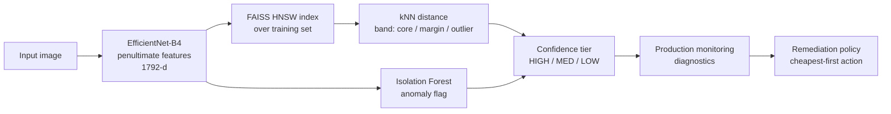

# pitwaller

**Embedding-space out-of-distribution detection, confidence tiering, and automated QA for CNN image classifiers.**

Given a binary classifier, its training dataset, and a production dataset, determine which data in the production dataset are OOD relative to the training dataset, and assign confidence scores based on OOD distance. Recommend remedial actions for the model based on model drift. Depends on certain assumptions about use case, and distribution as detailed in Limitations. 

Our demo runs end-to-end on synthetic data out of the box. To test:

```bash
pip install -e .
python -m pitwaller.demo
```

```
Fitted OOD model on 2000 samples (p50=0.0280, p90=0.0335)

Tier distribution on production batch:
  HIGH  88  (44%)
  MED   37  (18%)
  LOW   75  (38%)

Diagnostics:
  n=200  OOD=35%  margin=20%  IF=34%
  accuracy overall = 79% (baseline 95%, drop 16.0%)
  accuracy by tier = HIGH:95%, MED:81%, LOW:59%

Remediation -- biggest job required: ENGINE_REBUILD

[ENGINE_REBUILD]
  - FULL_BACKBONE_RETRAIN  (days, gpu:heavy, labels, redeploy)
      Accuracy down 16.0% (severe, broad); retrain the full backbone on a refreshed dataset.
```

Notice the accuracy-by-tier line: **95% → 81% → 59%**. The confidence tier is monotonically related to accuracy, which is the empirical property the entire design depends on and exploits.

---

## How it works



### 1. OOD detection in the model's own feature space

We use the classifier's penultimate-layer embeddings, in this case the 1792-dim global-pooled features of EfficientNet-B4. The training set's embeddings define the in-distribution manifold. Two independent detectors run over them:

- **kNN distance** via a **FAISS HNSW** index. For any input, the mean distance to its *k* nearest training neighbours is a non-parametric local-density score. Calibrated against the training set's own distance distribution, it yields two cut-points: the **50th percentile** (edge of the dense core) and the **90th percentile** (beyond which a point is sparser than 90% of training data).
- **Isolation Forest**, a global structural anomaly detector that catches off-manifold points kNN distance alone can miss.

### 2. Confidence tiering

| kNN band | Isolation Forest | Tier |
|----------|------------------|------|
| core (≤ p50) | clean | **HIGH** |
| core / margin | exactly one detector concerned | **MED** |
| margin / outlier | both concerned | **LOW** |

Points beyond the 90th percentile are treated as **LOW** by default (`strict_outlier=True`); set it to `False` to reproduce a literal "one-signal-is-MED" rule. The mapping is pure and table-driven, so it's auditable and unit-tested exhaustively.

### 3. From tiering to automated QA

Monitoring aggregates production predictions into **diagnostics** (OOD rate, tier-distribution drift, accuracy overall and per-tier, per-class recall). A transparent, priority-ordered **policy engine** maps those diagnostics onto a remediation ladder, cheapest and least destructive first:

| Action | Triggered by |
|--------|--------------|
| `THRESHOLD_ADJUSTMENT` | tier distribution drifted, but per-tier accuracy intact |
| `BN_RECALIBRATION` | covariate shift: inputs drift, accuracy still holds |
| `PARTIAL_BACKBONE_RETRAIN` | moderate, broad accuracy drop |
| `ADASYN_REBALANCE` | one or more classes' recall collapsing |
| `FULL_BACKBONE_RETRAIN` | severe broad accuracy drop |
| `PRUNING` | latency/size pressure while accuracy is healthy |
| `ARCHITECTURE_REBUILD` | OOD rate stays high *after* retraining — the capacity ceiling |

We diagnose the type and magnitude of failure, and escalate the recommendation when a cheap fix has been applied repeatedly without resolving the issue.

### 4. Pit stop vs. engine rebuild

Each type of remedial action is categorized in an effort tier according to how time-, labor-, and cost-intensive the fix is expected to be. We also specify whether the model can remain live in production during the remediation.

| Effort tier | Actions | What it costs | Model live? |
|-------------|---------|---------------|-------------|
| **PIT_STOP** | threshold adjust, BN recalibration | config/stats only, no training, seconds–minutes | ✅ stays live |
| **GARAGE** | pruning, partial retrain, ADASYN rebalance | bounded retrain on labelled data, hours | ⛔ redeploy |
| **ENGINE_REBUILD** | full backbone retrain | retrain the whole backbone, days, heavy GPU | ⛔ redeploy |
| **NEW_BUILD** | architecture rebuild | clean-sheet redesign, weeks, research effort | ⛔ redeploy |

(`GREEN_FLAG` is the fifth, no-action tier — everything within tolerance.)

`recommend()` returns recommendations cheapest-first; `group_by_effort()` buckets them by tier and `heaviest_tier()` tells you the biggest job this round of QA actually requires — so an operator instantly knows whether they're looking at a splash-and-go or a trip to the garage:

```python
from pitwaller import recommend, group_by_effort, heaviest_tier

recs = recommend(diag)
print("biggest job:", heaviest_tier(recs).value)        # e.g. ENGINE_REBUILD
for tier, group in group_by_effort(recs).items():
    print(tier.value, [r.action.value for r in group])
```

The bucketing never contradicts the cost ladder (there's a test for that): a heavier tier always implies a strictly costlier action.

---

## Usage

```python
import numpy as np
from pitwaller import ConfidencePipeline, MockEmbedder, aggregate, recommend, PredictionRecord

# Swap MockEmbedder for EffNetB4Embedder in production (needs `pitwaller[torch]`).
pipe = ConfidencePipeline(MockEmbedder(dim=64), k=10, contamination=0.05)
pipe.fit(train_inputs)                      # fit OOD reference on training data

scored = pipe.score(production_inputs)      # -> [ScoredSample(ood=..., tier=...)]

records = [PredictionRecord(ood=s.ood, tier=s.tier, pred_label=p, true_label=y)
           for s, p, y in zip(scored, preds, labels)]
diag = aggregate(records, baseline_high_rate=0.85, baseline_accuracy=0.95)

for rec in recommend(diag):
    print(rec.severity.value, rec.action.value, "-", rec.rationale)
```

Using real EfficientNet-B4 features:

```python
from pitwaller.embeddings import EffNetB4Embedder
pipe = ConfidencePipeline(EffNetB4Embedder(device="cuda"))
```

Using CLIP features for semantic-novelty detection (needs `pitwaller[clip]`):

```python
import torch
from pitwaller.embeddings import CLIPEmbedder

emb = CLIPEmbedder(model_name="ViT-B-32", device="cuda")
batch = torch.stack([emb.preprocess(img) for img in pil_images])  # canonical CLIP transform
pipe = ConfidencePipeline(emb).fit(train_batches)
```

### Choosing the embedding

The OOD stack is substrate-agnostic — everything downstream of the `Embedder` works on whatever features you feed it — so the most consequential choice is *which* representation you measure novelty in:

- **The model's own task features** (`EffNetB4Embedder`) measure novelty *relative to what that model attends to*. Good when you're gating **this model's** competence — "is this input outside what my classifier was built to handle?" But these features are tuned to the training label set and collapse whatever was irrelevant to that task, so semantic content along those collapsed axes maps into existing clusters and goes undetected. A model can't reliably surface, through its own representation, the content it was never built to perceive.
- **Foundation / vision-language features** (`CLIPEmbedder`; DINOv2 is another strong option) carry broad semantic content rather than a narrow label set, so they're far stronger for detecting genuinely **novel content** (near-OOD / open-set / new categories). CLIP additionally lets you *characterize* what's novel by comparing against text-grounded concepts, not just flag that something is.

Rule of thumb: gating one model's competence → its own features are fine; cataloguing semantic content outside the training distribution (the open-set/novel-category goal) → use a foundation embedding. For near-OOD semantic novelty the representation matters more than the OOD score, so swapping the substrate moves the needle more than tuning kNN vs Isolation Forest.

---

## Example: wrapping a classifier

Say you have a trained image classifier and want to gate its predictions by confidence. Fit the OOD reference once on the training set, then score production inputs and route by tier.

```python
from pitwaller import ConfidencePipeline, Tier
from pitwaller.embeddings import EffNetB4Embedder

# Fit the OOD reference on the same data the classifier was trained on.
# (EffNetB4Embedder needs `pitwaller[torch]`; swap in any Embedder you like.)
pipe = ConfidencePipeline(EffNetB4Embedder(device="cuda"), k=10, contamination=0.05)
pipe.fit(train_images)

# Score production inputs; trust HIGH, send the rest for review / a fallback.
for inp, scored in zip(prod_inputs, pipe.score(prod_inputs)):
    pred = classifier(inp)
    if scored.tier is Tier.HIGH:
        accept(pred)
    else:
        route_to_review(inp, pred)   # MED / LOW
```

When labels arrive (often late), aggregate a window of predictions into diagnostics and ask the policy what to do:

```python
from pitwaller import PredictionRecord, aggregate, recommend

records = [PredictionRecord(ood=s.ood, tier=s.tier, pred_label=p, true_label=y)
           for s, p, y in zip(scored_window, preds, labels)]
diag = aggregate(records, baseline_high_rate=0.85, baseline_accuracy=0.95)

for rec in recommend(diag):
    print(rec.severity.value, rec.action.value, "-", rec.rationale)
```

If the policy recommends `BN_RECALIBRATION` (covariate shift — inputs drifted, accuracy held), `bn_recal.py` gives you the justify → recalibrate → validate path so you don't fire it blind:

```python
from pitwaller.bn_recal import (
    collect_bn_stats, feature_stats, bn_shift_report, should_recalibrate,
    recalibrate_bn, validate_recalibration,
)

# 1. Justify: did the BatchNorm input stats actually move?
report = bn_shift_report(
    collect_bn_stats(model),
    {name: feature_stats(acts) for name, acts in recent_activations.items()},
)
if should_recalibrate(report, w2_threshold):
    # 2. Recalibrate on fresh, unlabelled inputs (forward passes only).
    recalibrate_bn(model, fresh_unlabelled_batches)
    # 3. Validate: promote only on a significant net improvement (McNemar).
    if validate_recalibration(correct_before, correct_after).significant_improvement():
        promote(model)
```

For a runnable version on synthetic data (no weights or dataset required), see [`examples/quickstart.py`](examples/quickstart.py) and `python -m pitwaller.demo`.

---

## Project layout

```
src/pitwaller/
  embeddings.py   Embedder protocol; MockEmbedder + EffNetB4Embedder
  index.py        FAISS HNSW index (+ numpy brute-force fallback)
  ood.py          kNN-distance + Isolation Forest, percentile thresholds
  confidence.py   HIGH / MED / LOW tiering (pure, table-driven)
  calibration.py  conformal thresholds, risk-coverage/AURC, cost/constraint
                  operating points, bootstrap CIs
  bn_recal.py     BatchNorm recal: 2-Wasserstein shift test, AdaBN, McNemar
  monitoring.py   aggregate predictions -> diagnostics
  decisions.py    remediation escalation policy engine
  pipeline.py     end-to-end orchestration
  demo.py         runnable synthetic walkthrough
tests/            80 tests across every component
examples/         quickstart.py, calibration_analysis.py
```

## Limitations & when to use this

This system was developed for a highly specific use case, and depends on some highly specific assumptions: 

- **OOD distance is a proxy for error, not error itself.** It flags inputs that are *novel*, not inputs that are *wrong*; confident in-distribution mistakes (overlapping classes, label noise, hard examples) pass through as HIGH.
- **It detects covariate shift, not concept drift.** If p(x) is stable but p(y|x) changes, the OOD signals stay quiet while accuracy falls — only the label-dependent accuracy monitor will notice.
- **It works in the model's own feature space**, which is optimised for class separation, not density. Genuinely novel inputs can collapse into dense regions and score as in-distribution, and in high dimensions the distance bands are thin and noise-sensitive.
- **The supervised half needs labels.** Accuracy-, recall-, and McNemar-based triggers depend on labelled production data, which is usually delayed and selection-biased; without labels you only have the unsupervised OOD signals.
- **The remediation policy is heuristic.** Its thresholds are tunable defaults, its symptom→fix mapping is correlational, and it has no built-in outcome feedback — treat its output as a ranked suggestion for a human, not an autopilot.
- **Conformal guarantees assume exchangeability**, which shift violates; the weighted variant helps only with good density-ratio estimates, and coverage is marginal, not per-class.

### Worth the effort when

- **Silent errors are expensive** — medical imaging, defect detection, perception, fraud — so routing low-confidence cases to a human or fallback pays for the overhead.
- **Your real risk is covariate shift** — new sensors/cameras, seasonal or geographic drift, an evolving input mix — which is the failure mode it actually detects well.
- **The model is long-lived and you'll maintain it**, so the per-checkpoint cost of rebuilding the index and recalibrating amortises.
- **The training distribution has clear structure** — clustered, well-sampled, with novel inputs genuinely off-manifold — so the kNN/IF geometry separates cleanly.
- **You can act on the tiers** — a review queue, a fallback model, a retraining loop — and at least some labels arrive eventually.

### Probably overkill when

- **Errors are cheap or easily corrected** (recommendations, soft tagging) — a max-softmax threshold or a simple accuracy dashboard is enough.
- **The input stream is stationary** (closed-world, controlled capture conditions) — drift detection is solving a non-problem.
- **Your dominant risk is concept or label drift** — invest in labelled drift tests on p(y|x) instead; this system is largely blind to it.
- **The model is short-lived** (prototypes, rapidly-replaced models) — the maintenance overhead never amortises.
- **Serving is latency- or memory-constrained** (edge) — a parametric score (Mahalanobis, energy) beats carrying the whole training-embedding index and running kNN per inference.
- **You have no labels and no capacity to act** — the auto-QA loop is then decorative.

## Install

```bash
pip install -e .              # core: numpy, scikit-learn, faiss-cpu
pip install -e '.[torch]'     # + real EfficientNet-B4 features
pip install -e '.[dev]'       # + pytest, ruff
pytest                        # 80 tests
```

## License

MIT
